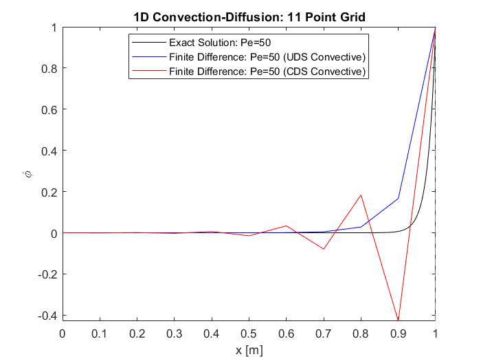
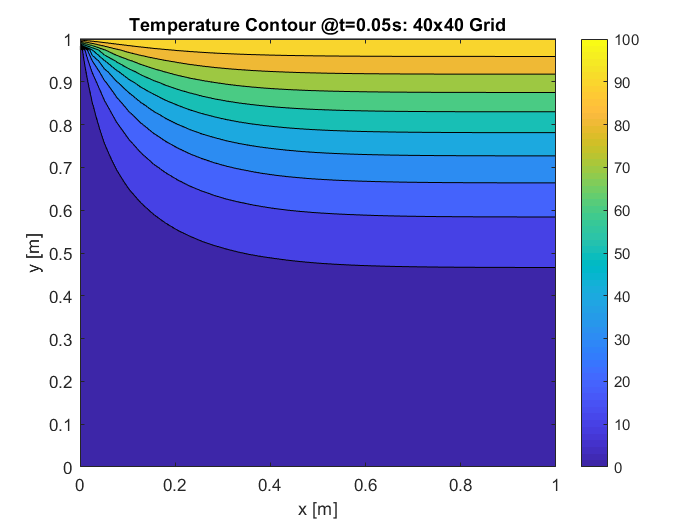
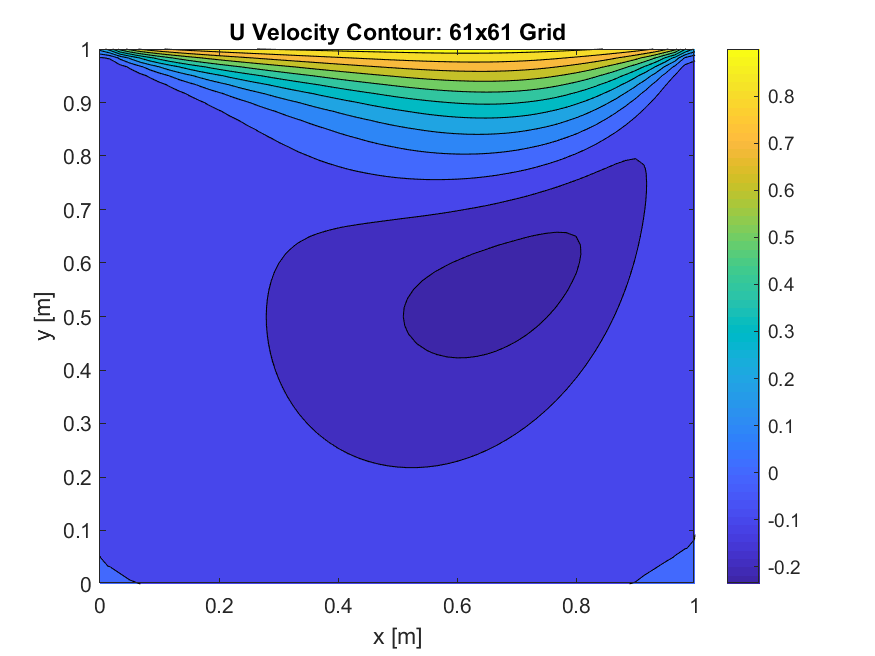

# matlab_CFD
Example CFD solvers implemented in MATLAB

This repo. is mostly a reference for future me, and is offered As-Is with no Guarantees or Warranties.

### 1D Convection/Diffusion (FDM):
Simple solution of 1D Convection/Diffusion PDE on various grid sizes with configurable parameters

### 2D Unsteady Heat Conduction (FDM):
Simple solution of Unsteady 2D Heat Conduction PDE, again various grid sizes with configurable parameters. Both Explicit and Implicit Euler schemes (time solution) are presented

### 2D Unsteady Lid-Driven Cavity problem (FVM):
Example of using developed Navier-Stokes solver. The solver assumes Incompressible flow, Explicit Euler scheme for time, with variables stored on co-located grids, and solved on a uniform grid.

